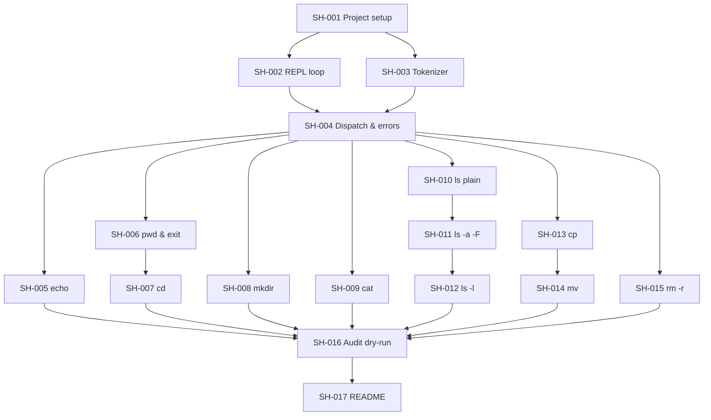
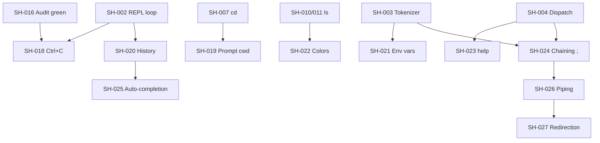

# Ticket dependency map

Read this before picking work from the board. An arrow **A → B** means: **finish A before starting B** (or at least its blocking parts).

---

## Visual map (mandatory path)



## Bonus track (optional, after core)



---

## Phases (recommended order)

| Phase | Tickets | Who can work in parallel |
|-------|---------|--------------------------|
| **0 — Bootstrap** | SH-001 | 1 person |
| **1 — Skeleton** | SH-002, SH-003, SH-004 | 2 people (REPL + tokenizer split, then one merges them in SH-004) |
| **2 — Commands** | SH-005 … SH-015 | **3 people** — eleven independent tickets, only two short chains |
| **3 — QA & docs** | SH-016, SH-017 | 2 people (docs can draft while QA runs) |
| **4 — Bonus** | SH-018 … SH-024 | Any time **after SH-016 is green** |
| **5 — Backlog** | SH-025, SH-026, SH-027 | Only if the deadline is comfortably clear |

---

## Per-ticket: blocked by → unlocks

| Ticket | Blocked by (must be done first) | Unlocks (can start after) |
|--------|----------------------------------|---------------------------|
| **SH-001** | — | SH-002, SH-003 |
| **SH-002** | SH-001 | SH-004, SH-018, SH-020 |
| **SH-003** | SH-001 | SH-004, SH-021, SH-024 |
| **SH-004** | SH-002, SH-003 | SH-005–SH-015, SH-023, SH-024 |
| **SH-005** | SH-004 | SH-016 |
| **SH-006** | SH-004 | SH-007, SH-016 |
| **SH-007** | SH-004, SH-006 *(shares path-resolution helper)* | SH-016, SH-019 |
| **SH-008** | SH-004 | SH-016 |
| **SH-009** | SH-004 | SH-016 |
| **SH-010** | SH-004 | SH-011, SH-012, SH-016, SH-022 |
| **SH-011** | SH-010 | SH-012, SH-016, SH-022 |
| **SH-012** | SH-010, SH-011 *(flag parser must exist)* | SH-016 |
| **SH-013** | SH-004 | SH-014, SH-016 |
| **SH-014** | SH-004, SH-013 *(reuses copy fallback)* | SH-016 |
| **SH-015** | SH-004 | SH-016 |
| **SH-016** | SH-005–SH-015 | SH-017, all bonus |
| **SH-017** | SH-016 *(draft earlier OK)* | — |
| **SH-018** | SH-002, SH-016 | — |
| **SH-019** | SH-007 | — |
| **SH-020** | SH-002 | SH-025 |
| **SH-021** | SH-003 | — |
| **SH-022** | SH-010, SH-011 | — |
| **SH-023** | SH-004 | — |
| **SH-024** | SH-003, SH-004 | SH-026 |
| **SH-025** | SH-020 *(needs raw-mode input)* | — |
| **SH-026** | SH-024 | SH-027 |
| **SH-027** | SH-026 | — |

---

## What each person can pick **right now**

Assuming nothing is done yet:

| After completing… | Safe next tickets |
|-------------------|-------------------|
| Nothing | **SH-001** only |
| SH-001 | **SH-002**, **SH-003** (split between two people) |
| SH-002 + SH-003 | **SH-004** |
| SH-004 | **SH-005**, **SH-006**, **SH-008**, **SH-009**, **SH-010**, **SH-013**, **SH-015** (any split) |
| SH-006 | **SH-007** |
| SH-010 | **SH-011** → **SH-012** |
| SH-013 | **SH-014** |
| All of SH-005–SH-015 | **SH-016** |
| SH-016 green | **SH-017** and the whole bonus track |

---

## Critical path (longest chain)

Minimum sequence if one person did everything:

```
SH-001 → SH-002 → SH-004 → SH-010 → SH-011 → SH-012 → SH-016 → SH-017
```

With 3 people, shorten calendar time by running **SH-003 alongside SH-002**, then fanning SH-005–SH-015 three ways. The `ls` chain is the only 3-deep sequence in Phase 2 — whoever owns it should start it the moment SH-004 lands, or it becomes the schedule.

---

## Parallel work example (team)

| Person | Week 1 | Week 2 | Week 3 |
|--------|--------|--------|--------|
| **Andriana** | SH-001 → SH-002 → SH-003 | SH-006 → SH-007 | SH-016, SH-021, SH-024 (bonus) |
| **Iana** | *(blocked until SH-003)* | SH-004 → SH-013 → SH-014, SH-015 | SH-012, SH-018, SH-020, SH-023 (bonus) |
| **Sofia** | *(blocked until SH-004)* | SH-005, SH-008, SH-009, SH-010 → SH-011 | SH-012 unblocked for Iana, SH-017, SH-019, SH-022 (bonus) |

**Now:** Andriana owns the whole foundation phase — **SH-001 → SH-002 → SH-003** — solo this week. Iana and Sofia are both dependency-blocked until SH-004 lands (which itself waits on SH-002 and SH-003), so neither has unblocked work until Andriana clears the gate.

---

## Notes

- **SH-002 vs SH-003:** agree the tokenizer signature (`fn tokenize(&str) -> Result<Vec<String>, ParseError>`) before splitting, so SH-004 is a merge and not a rewrite.
- **SH-004 is the real gate.** Two of three people are blocked behind it — treat it as highest priority once SH-002 and SH-003 land, and keep it small: a dispatch table and an error enum, nothing more.
- **SH-011 before SH-012:** the flag parser lives in SH-011. Doing `-l` first means writing flag parsing twice.
- **SH-013 before SH-014:** `mv` falls back to copy-then-delete when `rename` fails across filesystems (`EXDEV`), so it reuses the `cp` walker.
- **SH-006 before SH-007:** both need the same "resolve operand against cwd" helper; whoever writes it first owns it.
- **SH-016 gates the bonus track.** A bonus feature earns nothing if a mandatory checklist item fails — no one starts Phase 4 while Phase 2 has an open ticket.
- **SH-018 after SH-016:** installing a SIGINT handler changes control flow through the whole REPL. Doing it before the core is verified means re-verifying everything.
- **SH-025–027 are backlog, not plan.** Piping and redirection need `fork`/`pipe`/`dup2` and an in-process execution model — that's a rearchitecture of SH-004, not an add-on.
